<div align="center">

# HelmX: AI-Powered Smart Helmet Platform

**The web platform for HelmX, a smart motorcycle helmet that brings crash detection, drowsiness alerts, navigation, cameras, voice control, entertainment and environmental sensing together in one device.**

Final Year Project · BS Computer Science · University of the Punjab


### [🌐 Live Demo: helmx-silk.vercel.app](https://helmx-silk.vercel.app/)

<a href="https://helmx-silk.vercel.app/">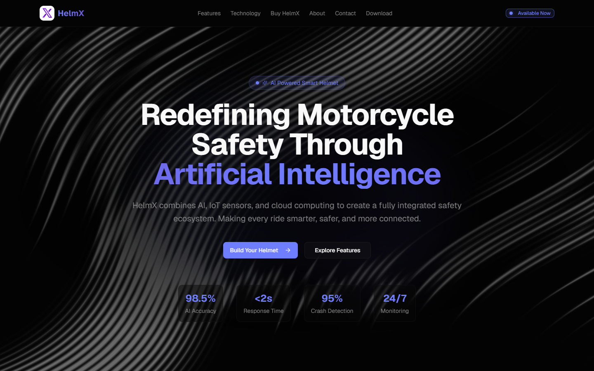</a>

</div>

---

## Table of contents

- [About the project](#about-the-project)
- [Key features](#key-features)
- [Screenshots](#screenshots)
- [Architecture](#architecture)
- [Engineering highlights](#engineering-highlights)
- [Tech stack](#tech-stack)
- [Getting started](#getting-started)
- [Project structure](#project-structure)
- [Testing and quality](#testing-and-quality)
- [Team](#team)

## About the project

Motorcycle riders face high accident risks, and many existing smart-helmet products focus on a single capability. **HelmX** combines seven safety and lifestyle features in one cost-effective helmet, built on a Raspberry Pi with cameras, motion, GPS, GSM and environmental sensors.

This repository branch contains the **HelmX web platform**, the public face of the product, where people can:

- learn about the helmet and its seven core features,
- **configure their own helmet** part by part with a live 3D preview and an instant price quote,
- **pay securely** through Stripe and receive an emailed receipt,
- **contact the team** through a validated, rate-limited contact form.

**Try it live:** <https://helmx-silk.vercel.app/>. The landing page and 3D configurator are fully interactive.

> Other HelmX modules, such as the Android companion app and the drowsiness-detection system, are developed on separate branches of this repository.

## Key features

| | Feature | Details |
|---|---|---|
| 🪖 | **Interactive 3D configurator** | Real-time WebGL helmet preview (React Three Fiber) with 14 hardware parts across three groups and six storage tiers |
| 💳 | **Secure checkout** | Stripe Checkout with **server-side pricing**: the browser sends only part IDs, never an amount |
| 🧾 | **Automated receipts** | Itemised HTML receipt emailed exactly once per order, even if Stripe retries its webhook |
| 📬 | **Contact system** | Validation, per-IP rate limiting, HTML-escaped emails to both the admin and the sender |
| 📱 | **Fully responsive** | Desktop and mobile layouts, slide-out mobile navigation, reduced-motion support |
| ⚡ | **Performance-minded** | Lazy-loaded 3D scene, animations that pause off-screen, optimised AVIF/WebP images |

## Screenshots

> Captured from the production build. The confirmation screens (payment success, message sent) use sample data, since they normally require live Stripe and email services.

### Landing page

<table>
  <tr>
    <td width="50%">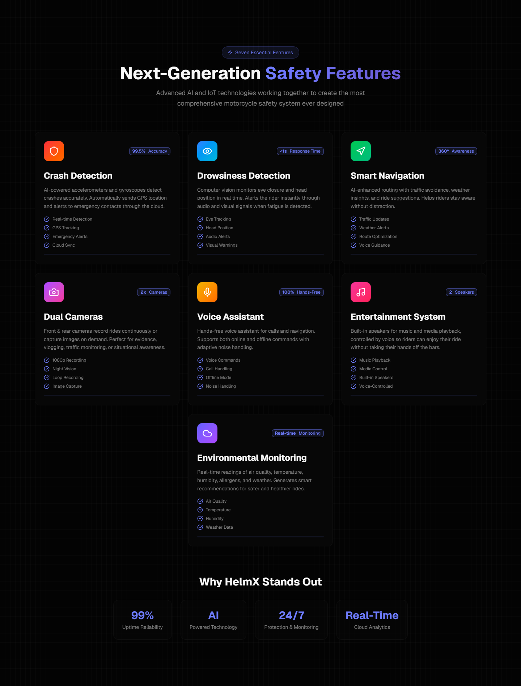<p align="center"><b>Seven core safety and lifestyle features</b></p></td>
    <td width="50%">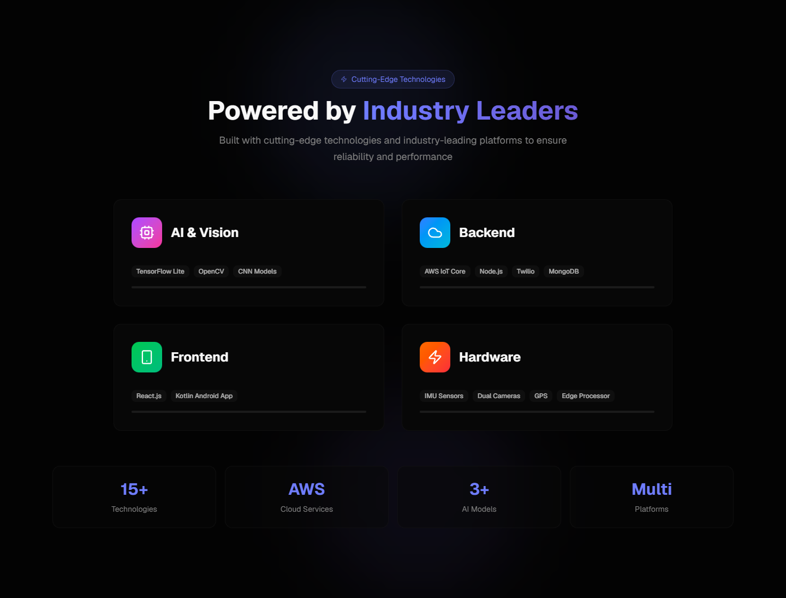<p align="center"><b>Technology behind the helmet</b></p></td>
  </tr>
  <tr>
    <td width="50%">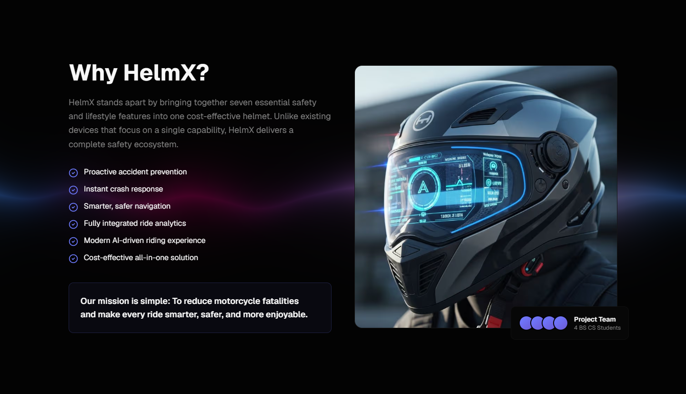<p align="center"><b>Why HelmX</b></p></td>
    <td width="50%">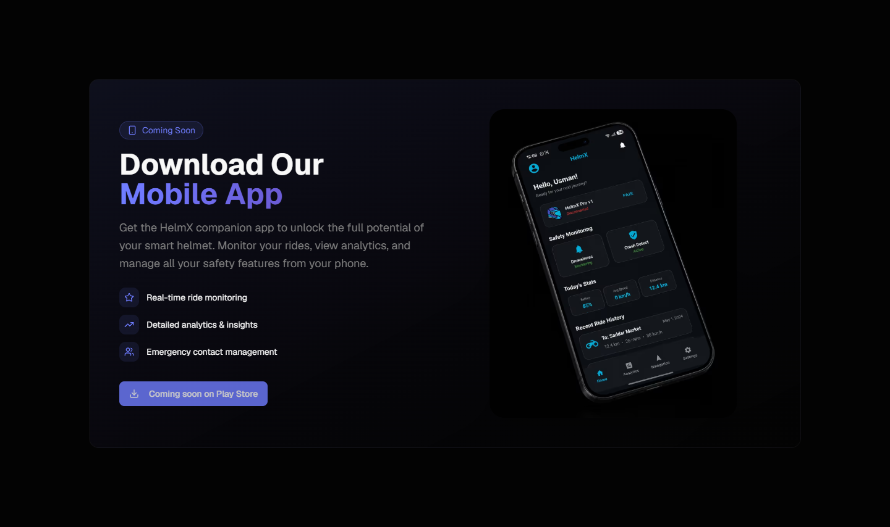<p align="center"><b>Companion mobile app</b></p></td>
  </tr>
</table>

### Helmet configurator

<table>
  <tr>
    <td width="50%">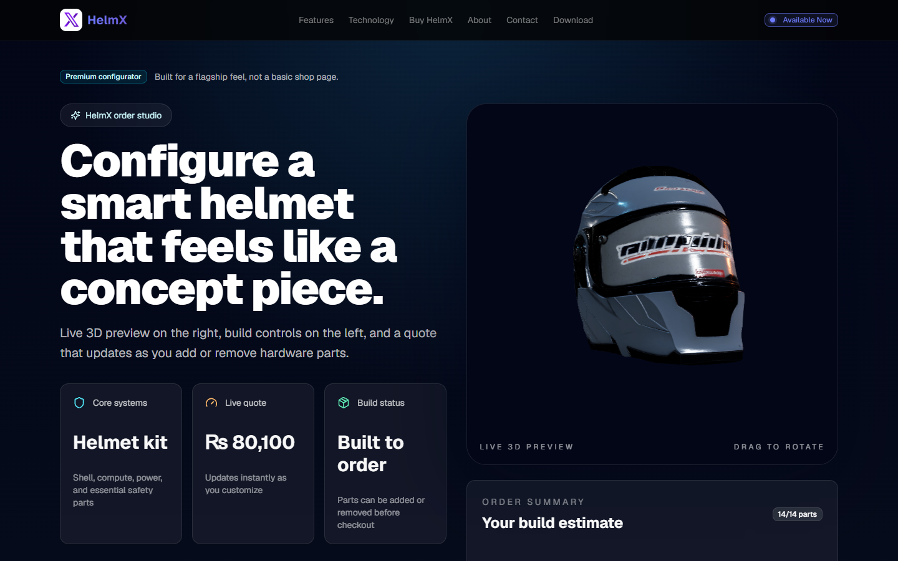<p align="center"><b>Live 3D preview and instant quote</b></p></td>
    <td width="50%">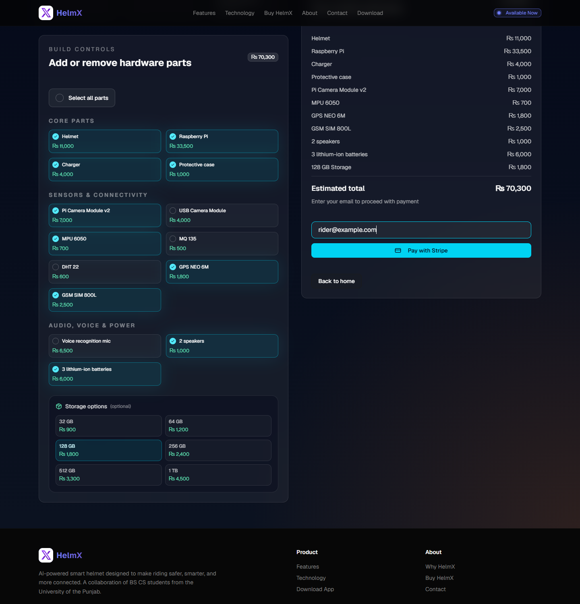<p align="center"><b>Custom build: parts, storage and order summary</b></p></td>
  </tr>
</table>

### Checkout and receipts

<table>
  <tr>
    <td width="33%">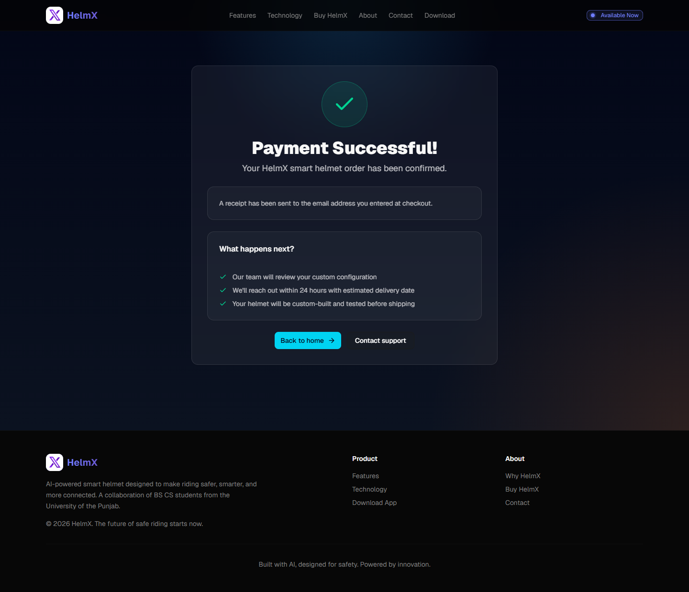<p align="center"><b>Payment confirmed</b></p></td>
    <td width="33%">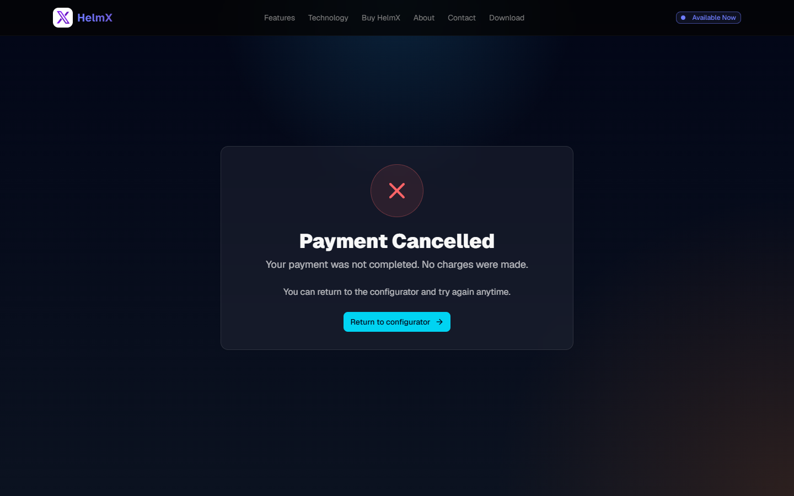<p align="center"><b>Payment cancelled</b></p></td>
    <td width="33%">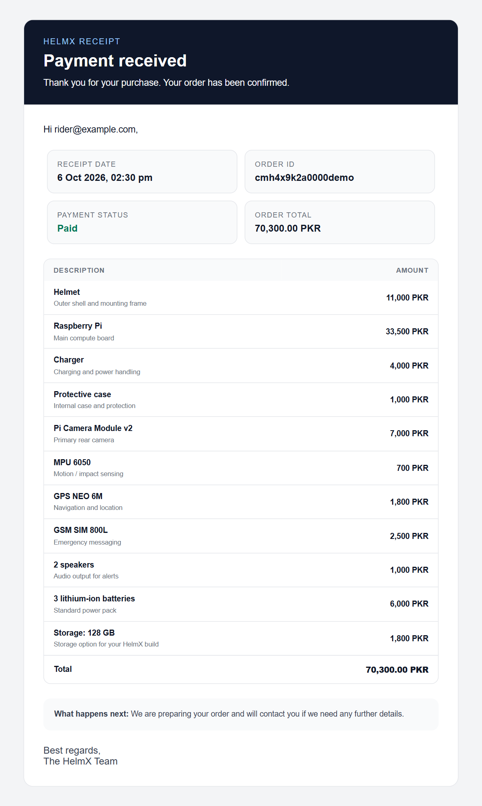<p align="center"><b>Itemised email receipt</b></p></td>
  </tr>
</table>

### Contact

<table>
  <tr>
    <td width="50%">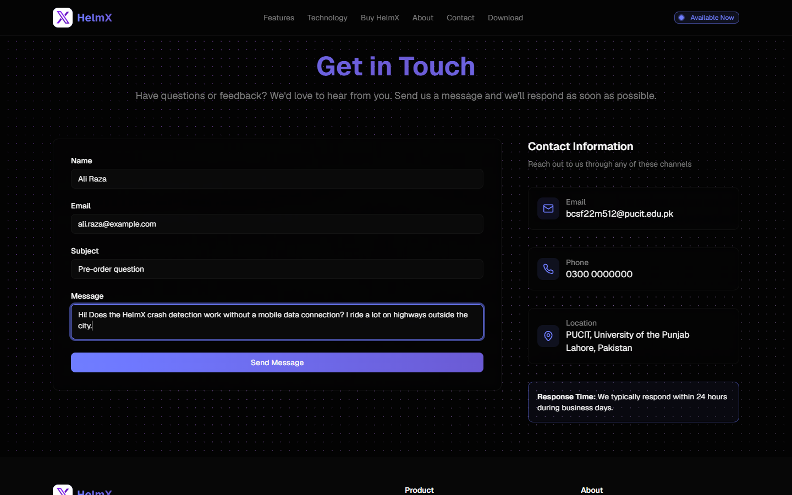<p align="center"><b>Contact form</b></p></td>
    <td width="50%">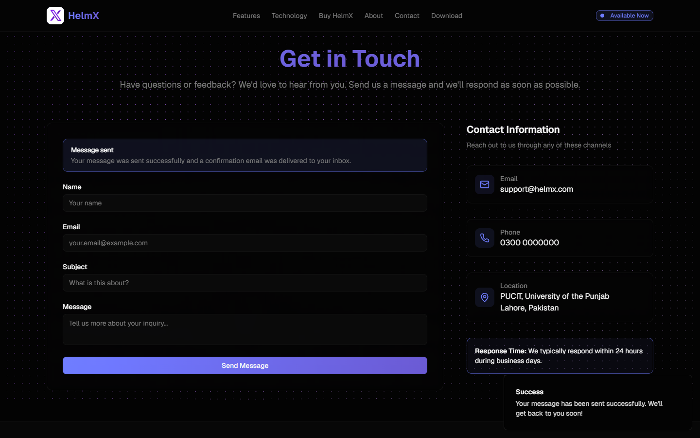<p align="center"><b>Submission confirmed</b></p></td>
  </tr>
</table>

### Mobile

<table>
  <tr>
    <td width="33%">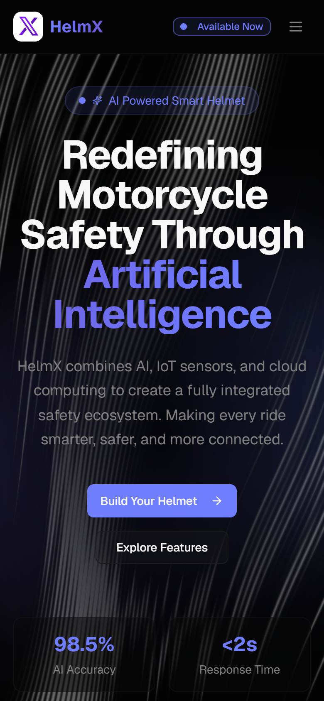<p align="center"><b>Home</b></p></td>
    <td width="33%">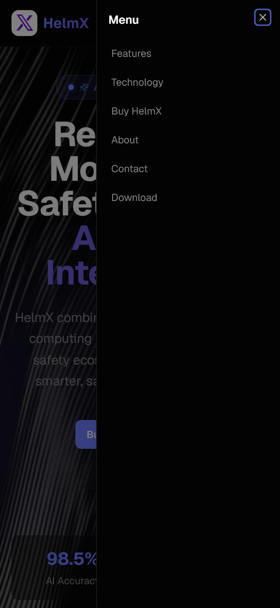<p align="center"><b>Navigation menu</b></p></td>
    <td width="33%">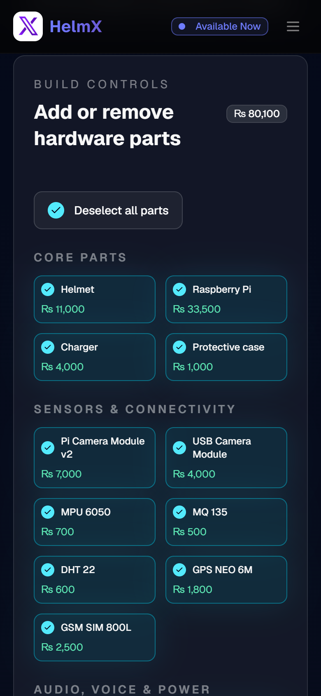<p align="center"><b>Configurator</b></p></td>
  </tr>
</table>

## Architecture

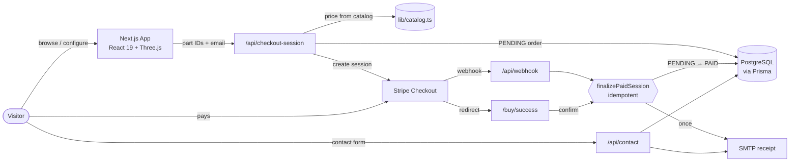

**Order lifecycle:** `PENDING` → `PAID` (payment confirmed) or `FAILED` (session expired / async payment failed). A paid order is never downgraded.

## Engineering highlights

- **Tamper-proof pricing.** One catalog module ([`lib/catalog.ts`](lib/catalog.ts)) drives both the UI and the server. The checkout API rejects unknown parts and computes the amount itself, so a modified request cannot change the price.
- **Idempotent payment finalization.** The Stripe webhook and the success page both call one function ([`lib/orders.ts`](lib/orders.ts)) that performs an atomic `PENDING → PAID` update. Only the caller that wins the transition sends the receipt, so duplicate deliveries never send duplicate emails.
- **Secure by default.** Webhook signatures are verified, all user input is HTML-escaped before it reaches an email, contact submissions are length-limited and rate-limited, and the developer test-email endpoint is disabled in production.
- **Performance.** The three.js bundle and 3D model load only on the configurator page. WebGL and canvas animations stop rendering when scrolled off-screen, and the hero animation is pure CSS, so it doesn't wait for JavaScript.
- **Accessibility.** Semantic labels, `aria-pressed` toggles, keyboard-reachable mobile menu, and `prefers-reduced-motion` support across all animations.

## Tech stack

| Layer | Technologies |
|---|---|
| **Frontend** | Next.js 16 (App Router), React 19, TypeScript, Tailwind CSS 4, shadcn/ui, Radix UI |
| **3D and graphics** | Three.js, React Three Fiber, Drei, OGL (WebGL shaders) |
| **Backend** | Next.js Route Handlers, Prisma 7 ORM, PostgreSQL |
| **Payments** | Stripe Checkout + webhooks |
| **Email** | Nodemailer (SMTP) |
| **Quality** | ESLint (Next.js core-web-vitals), Vitest, strict TypeScript |

## Getting started

### Prerequisites

- Node.js 20+
- PostgreSQL database
- Stripe account (test mode) and the [Stripe CLI](https://docs.stripe.com/stripe-cli)
- SMTP credentials

### Installation

```bash
# 1. Clone the web branch
git clone -b web-app https://github.com/Usman-Azfar/HelmX-AI-Powered-Smart-Helmet.git
cd HelmX-AI-Powered-Smart-Helmet

# 2. Install dependencies (also generates the Prisma client)
npm install

# 3. Configure environment
cp .env.example .env.local   # used by Next.js
cp .env.example .env         # used by the Prisma CLI
# then fill in the values

# 4. Create database tables
npm run db:push

# 5. Run the app
npm run dev
```

Open <http://localhost:3000>. To receive payment webhooks locally, run `stripe listen --forward-to localhost:3000/api/webhook` in a second terminal. See [STRIPE_SETUP.md](STRIPE_SETUP.md) for the full payment setup.

### Environment variables

| Variable | Purpose |
|---|---|
| `DATABASE_URL` | PostgreSQL connection string |
| `STRIPE_SECRET_KEY` | Stripe secret key (`sk_...`) |
| `STRIPE_WEBHOOK_SECRET` | Webhook signing secret (`whsec_...`) |
| `NEXT_PUBLIC_APP_URL` | Public base URL used for Stripe redirects |
| `SMTP_HOST`, `SMTP_PORT`, `SMTP_SECURE`, `SMTP_USER`, `SMTP_PASS` | Outgoing mail server |
| `EMAIL_FROM` *(optional)* | Sender address |
| `ADMIN_EMAIL` *(optional)* | Receives contact-form notifications |

### Scripts

| Command | Description |
|---|---|
| `npm run dev` | Start the development server |
| `npm run build` / `npm start` | Production build / serve |
| `npm run lint` | Lint the codebase |
| `npm run typecheck` | Type-check without emitting |
| `npm test` | Run unit tests |
| `npm run db:push` | Sync the Prisma schema to the database |

## Project structure

```
app/
├── api/
│   ├── checkout-session/     # Create & confirm Stripe Checkout Sessions
│   ├── webhook/              # Stripe webhook handler
│   ├── contact/              # Contact form endpoint
│   └── debug/                # Dev-only SMTP check
├── buy/                      # Configurator and payment result pages
├── contact/                  # Contact page
└── page.tsx                  # Landing page
components/                   # Page sections, 3D scene, animated backgrounds, shadcn/ui
lib/
├── catalog.ts                # Parts, storage options, pricing
├── orders.ts                 # Order finalization and receipt email
├── stripe.ts · prisma.ts · email.ts · validation.ts
prisma/schema.prisma          # Order and ContactSubmission models
tests/                        # Vitest unit tests
docs/screenshots/             # README images
```

## Testing and quality

```bash
npm test          # pricing, validation, HTML escaping, receipt rendering
npm run lint
npm run typecheck
npm run build     # production builds fail on type errors
```

Unit tests cover the logic that protects money and users: catalog pricing (including tampered and unknown IDs), email validation, HTML escaping, and receipt rendering.

## Team

HelmX was built by BS Computer Science students at the University of the Punjab as their Final Year Project.

| Member | GitHub |
|---|---|
| Usman Azfar | [@Usman-Azfar](https://github.com/Usman-Azfar) |
| Hamza Ahmad | [@HamzaAhmad536](https://github.com/HamzaAhmad536) |
| Abdul Hannan | [@Rao-Abdul-Hannan](https://github.com/Rao-Abdul-Hannan) |
| Awais Imtiaz | — |
<!-- TODO: add Awais Imtiaz's GitHub profile and the project supervisor -->

---

<div align="center">
<sub>Built with care for safer roads.</sub>
</div>
